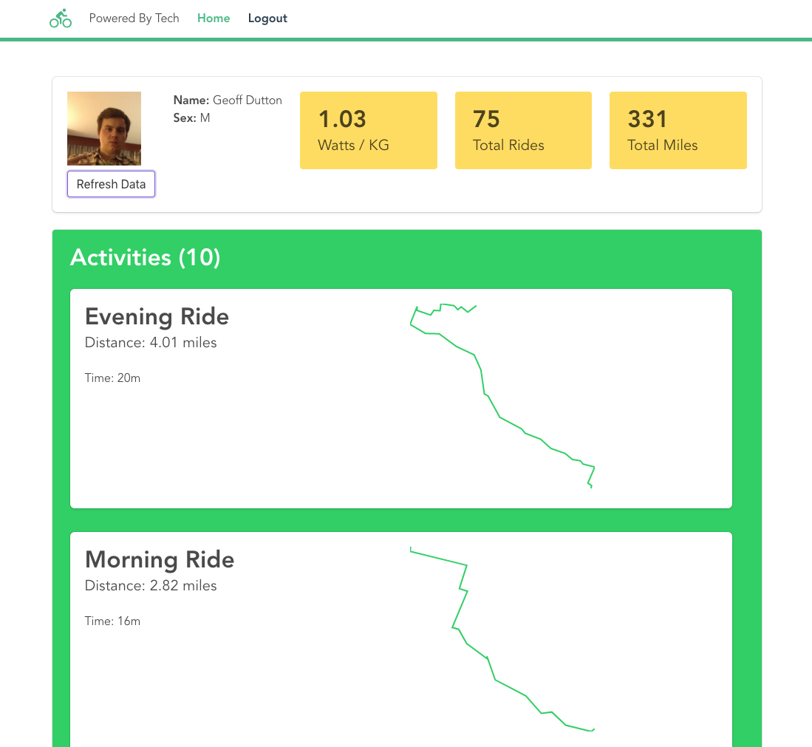

# Vue + Strava

This is my attempt at using Vue and the Strava api to display some visualizations and authentication.

I don't have a clear goal, but maybe someone will find something useful.

You can see a live example here: [Live Demo](https://beta.getpoweredby.tech/)

## Development
A few technologies used:
* [Vue.js](https://vuejs.org/) - Obviously
* [Jest](https://github.com/facebook/jest) - For testing
* [d3](https://d3js.org/) - For plotting the geo coordinates
* [Vue Dev Tools](https://github.com/vuejs/vue-devtools) - Chrome extension for debugging vue components and vuex state
* [Bulma](https://bulma.io/) - For a nice responsive layout and fun components
* [Stdlib](https://stdlib.com/#) - For the backend api
* [Netlify](https://www.netlify.com/) - For hosting

### Running Locally
It's pretty simple to fire up locally:
1. Git clone it
2. Run `yarn` to install dependencies
3. Run `yarn serve`

You will need to change the endpoint in the [.env.development](.env.development) file, and that also requires Stdlib to be running locally. Otherwise, you can point it at the `.env.production` endpoint. I will add the bit of code run by Stdlib, but it's not much.

### Deploying
There are a number of options for deploying to a live a site. I am currently using Netlify to pull from this repo's master branch. So the steps are:
1. Run `yarn build` which outputs a minified and optimized version
2. Push to github

You could also simply upload to S3.

## License
Just your run-of-the-mill [MIT](https://opensource.org/licenses/MIT).
